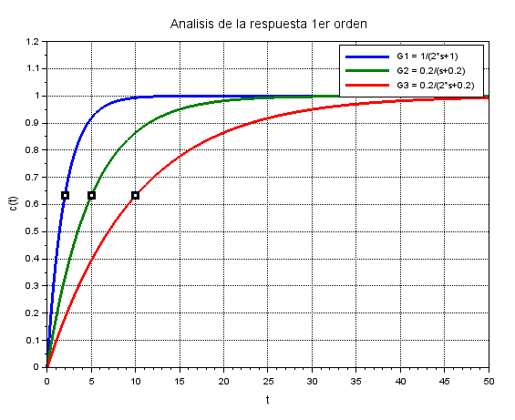
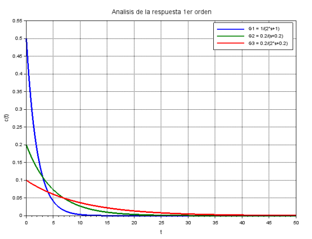
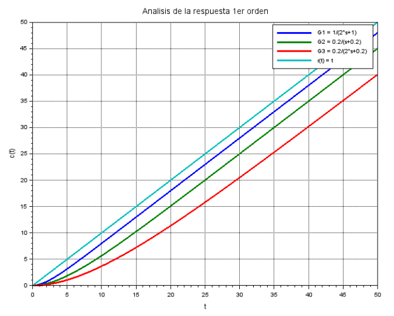
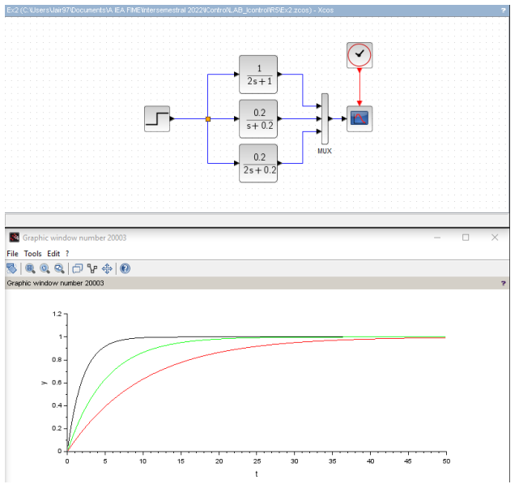
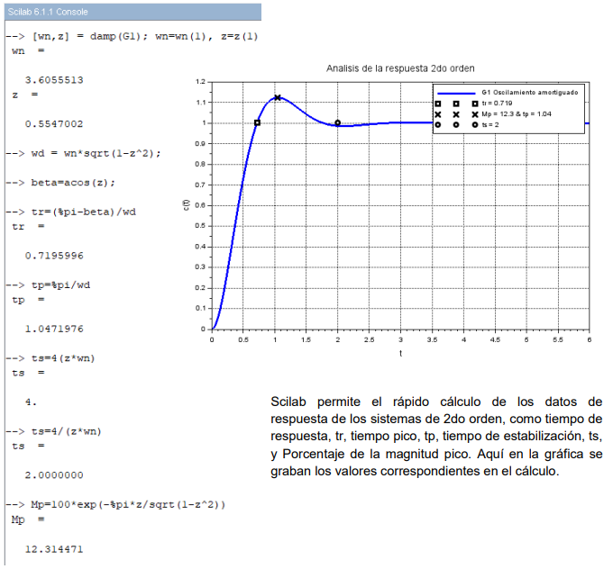
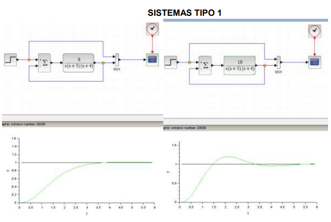
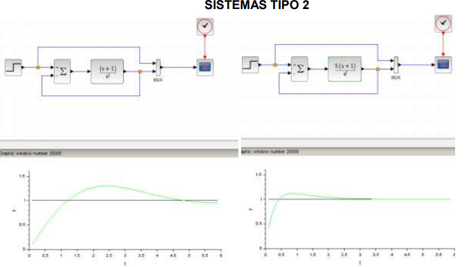

## Control-Theory
Control theory is one of the classes w/ branches of control that as an automation student I have on my engineering curriculum.

# Intro to Control Theory (IntroCT)
1. Intro to Control systems
2. Mathematical modelling
3. Frequency domain versus time domain
4. Time response: Transient and steady state response
5. Stability
6. Steady state error
7. Root Locus Method
8. Frequency response - Bode plot

 
 
 
 
 
 
 
 

# Classic Control Theory (Classic_CT)
- Root Locus Method 
1. Lead compensation 
2. Lag compensation 
3. Lag-lead compensation 

- Frequency Response Approach 
4. Lead compensation 
5. Lag compensation 
6. Lag-lead compensation 

# Modern Control Theory (Modern_CT)
1. State space representation
2. Solving the Time Invariant State Equation
3. Pole placement
4. Controllability
5. Regulator system design
6. Design of Servo Systems
7. Observability
8. Observer design
