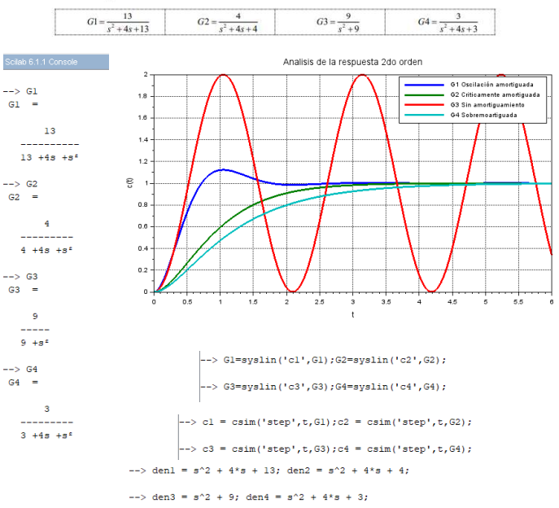

## Control-Theory
Control theory is one of the classes w/ branches of control that as an automation student I have on my engineering curriculum.

# Intro to Control Theory (IntroCT)
1. Intro to Control systems
2. Mathematical modelling
2. Frequency domain versus time domain
3. Time response: Transient and steady state response
4. Stability
5. Steady state error
6. Root Locus Method
7. Frequency response

 
 
 
 
 
 
 
 

# Classic Control Theory (Classic_CT)
1. Lead compensation Root Locus Method (RLM)
2. Lag compensation RLM
3. Lag-lead compensation RLM
1. Lead compensation Frequency Response Approach (FRA)
2. Lag compensation FRA
3. Lag-lead compensation FRA

# Modern Control Theory (Modern_CT)
1. State space model
2. Controllability
3. Controller design
3. Observability
4. Observer design
